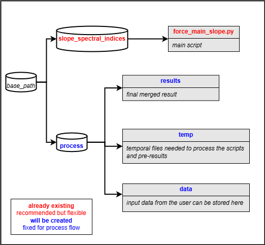

## Detecting slopes per pixel using spectral indices (DSWI)

The purpose of this repository is to extract the slope (trend) per pixel of spectral indices (DSWI) derived 
from Sentinel-2 using time series analysis with 10m resolution.The code uses Satellite Image Time Series (SITS) based on 
[FORCE Time Series framework](https://force-eo.readthedocs.io/en/latest/index.html). 

### 1. Installing

The basic parameters installations are implemented for Ubuntu 22.04 "jammy":

```
conda create --name SITSslope python==3.9
conda activate SITSslope
cd /path/to/repository/slope_spectral_indices
pip install -r requirements.txt
sudo apt-get install xterm
```

### 2. Output

The algorithm is pixel based. The output is a merged raster of your area of interest with the slope value per pixel. 
A positive slope means that the values are increasing in time, a negative value means that the values are decreasing in time.

### 3. Basics

- The **force_main_slope.py** has default tested parameters that can be modified considering user needs.
- The main script will create two more files, the parameter file (tsa_UDF.prm) and the User Defined Function (UDF_pixel.py)
file. The first is related to the needed information to run FORCE datacube; the second is related to the mowing detection algorithm.



- For more information about the parameter and UDF files, please check the above links.

### Authors

* [Sebastian Valencia](https://github.com/Azarozo19)

### License

This project is licensed under the GNU General Public Licence, Version 3 (GPLv3) - see the LICENSE.md file for details
